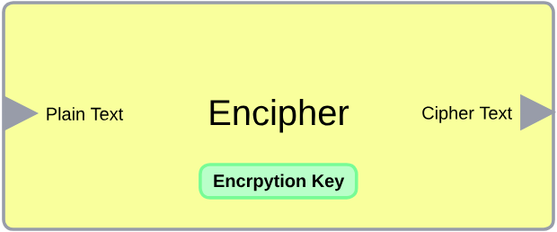

# AES-128 in UART 
The repo contains an implementation of Advanced Encryption Standard 128-bit block cipher in UART for serial communication.
## Selection 
+ UART for serial communication
+ AXI Stream Interface for UART 
+ Encryption for secure transmission
  + AES encryption module
  + AES deception module
+ Cyclic Redundancy Check (CRC-16) for data validation

##  Encryption Module

# Tx State Machine 

| **State**      | **hold** | **EnTx** | **tx_start** | **PISO_reset** | **en_crc** | **PISO_load** | **EN_UDR** | **Next State**                           |
|----------------|----------|----------|--------------|----------------|------------|---------------|------------|------------------------------------------|
| RESET          | 1        | 0        | 0            | 1              | 1          | 0             | 0          | (start) ? LOAD : IDEL                    |
| LOAD           | 1        | 0        | 0            | 0              | 1          | 1             | 0          | LoadByteToUDR                            |
| LoadByteToUDR  | 0        | 1        | 0            | 0              | 1          | 0             | 0          | START_UART_Tx                            |
| START_UART_Tx  | 1        | 1        | 1            | 0              | 1          | 0             | 1          | WAIT_DONE                                |
| WAIT_DONE      | 1        | 1        | 1            | 0              | 1          | 0             | 1          | (Done) ? WAIT_UNDONE : WAIT_DONE         |
| WAIT_UNDONE    | 1        | 1        | 0            | 0              | 1          | 0             | 1          | (!Done) ? CHECK_EMPTY : WAIT_UNDONE      |
| CHECK_EMPTY    | 1        | 0        | 0            | 0              | 1          | 0             | 0          | PISO_empty ? IDEL : LoadByteToUDR        |
| IDEL           | 1        | 0        | 0            | 1              | 1          | 0             | 0          | start ? LOAD : IDEL                      |
| default        | -        | -        | -            | -              | -          | -             | -          | RESET                                    |

.
## Complete Tx Core

## Rx State Machine

| **State**      | **Wr** | **EnRx** | **En_valadation** | **SIPO_reset** | **EnDec** | **Next State**                           |
|----------------|--------|----------|-------------------|----------------|-----------|------------------------------------------|
| START_RX       | 0      | 1        | 1                 | 0              | 0         | (Done) ? SIPO_WRITE : START_RX           |
| SIPO_WRITE     | 1      | 1        | 1                 | 0              | 0         | (full) ? EN_COMB : WAIT_UNDONE           |
| WAIT_UNDONE    | 0      | 1        | 1                 | 0              | 0         | (!Done) ? START_RX : WAIT_UNDONE         |
| EN_COMB        | 0      | 0        | 1                 | 0              | 1         | IDEL                                     |
| IDEL           | 0      | 0        | 1                 | 0              | 1         | (!tx_out) ? START_RX : IDEL              |
| default        | -      | -        | -                 | -              | -         | IDEL                                     |

## Complete Rx Core

## Results

